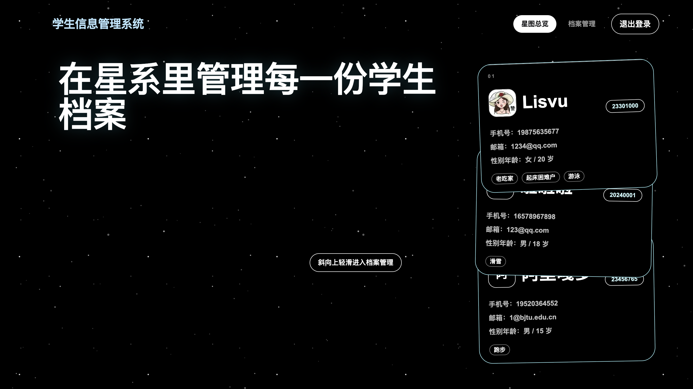

# Tailwind Website Style Skill

A reusable Codex skill for generating Tailwind CSS pages with a dark futuristic starfield style.

这个 Skill 用来帮助 AI 生成统一风格的前端页面，适合登录页、Landing Page、个人主页、后台管理页面等。

## Style

This skill uses a minimal dark space-inspired UI style:

- Black or near-black background
- Animated starfield effect
- White typography
- Pale blue / cyan accent colors
- Rounded pill buttons
- Thin white borders
- Minimal futuristic layout
- Responsive Tailwind CSS design

## Preview

You can place screenshots or demo images here.

### Homepage Example




## How to Use

Use this skill when you want to generate frontend pages with the same visual style.

Example prompt:

```text
Use the tailwind-website-style skill to create a responsive login page with Tailwind CSS.
